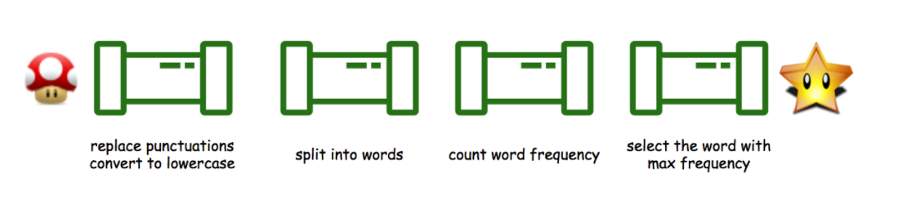

# String

## leetcode 819. Most Common Word

### https://leetcode.com/problems/most-common-word/




---

* 자바스크립트 풀이

```js
/**
 * @param {string} paragraph
 * @param {string[]} banned
 * @return {string}
 */
var mostCommonWord = function(paragraph, banned) {
    
    // 예외 처리
    if(!banned.length) return paragraph.toLowerCase().replace(/[^a-zA-Z]/g,'');
    
    let s = paragraph.replace(/[^a-zA-Z]/g,' ').split(' ');
    let hash = new Map();
    let result  = [];
    let answer = '';

    for(const ban of banned) {
        s = s.filter((str) => str.toLowerCase() !== ban.toLowerCase());
    }
    s = s.filter((el)=>el!=='').map((str) => str.toLowerCase());
    
    for(const str of s) {
        if(!hash.has(str)) {
            hash.set(str,1);
        }else{
            hash.set(str,hash.get(str)+1);
        }
    }
    
    // 해시 키를 배열에 넣어서 sort
    for(const [k,v] of hash) {
        result.push([k,v]);
    }
    
    result.sort((a,b)=>b[1]-a[1]);
    answer = result[0][0];
    return answer;
};
```
* 레퍼런스 풀이

```js
const mostCommonWord = (paragraph, banned) => {
  const bannedSet = new Set(banned);
  const words = paragraph.toLowerCase().split(/\W+/);
  const map = {};
  for (const w of words) {
    if (!bannedSet.has(w)) {
      if (map[w] == null) map[w] = 0;
      map[w]++;
    }
  }

  let res = '';
  let max = -Infinity;
  for (const w in map) {
    const count = map[w];
    if (count > max) {
      res = w;
      max = count;
    }
  }
  return res;
};
```

* 파이썬 풀이 

```py 
class Solution:
    def mostCommonWord(self, paragraph: str, banned: List[str]) -> str:
        words = [word for word in re.sub(r'[^\w]',' ', paragraph)
                 .lower().split()
                    if word not in banned]
        
        counts = collections.Counter(words)
        # 가장 많이 등장하는 단어의 첫 번째 인덱스 리턴 
        return counts.most_common(1)[0][0]
```

```py
class Solution:
    def mostCommonWord(self, paragraph: str, banned: List[str]) -> str:
        words = [word for word in re.sub(r'[^\w]',' ', paragraph)
                 .lower().split()
                    if word not in banned]
        
        counts = collections.defaultdict(int)
        for word in words:
            counts[word] +=1
        return max(counts, key=counts.get)
```